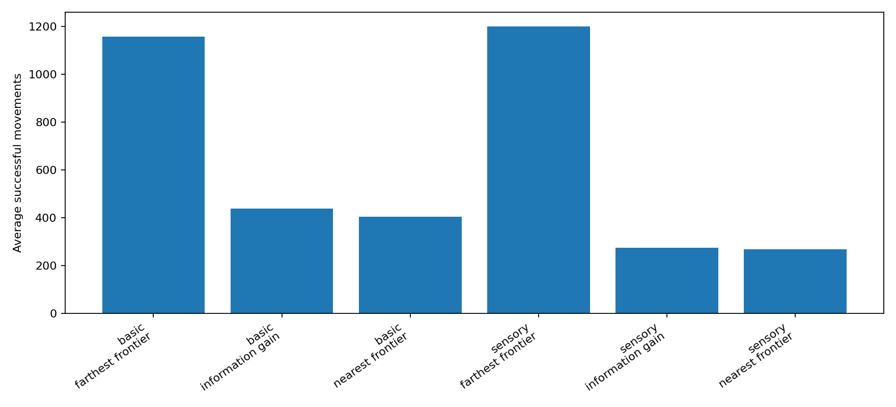
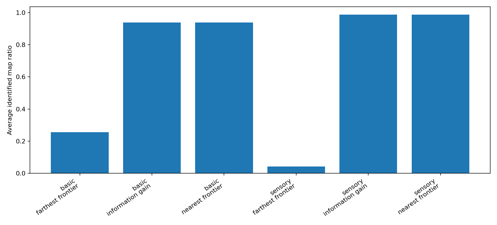
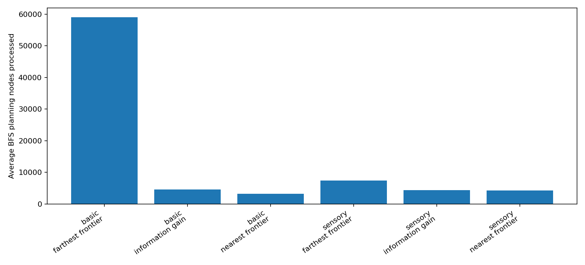

# Autonomous Maze Exploration Bot

Python simulation of autonomous agents exploring an initially unknown maze-like ship map. The project compares basic and sensory bot models using BFS-based planning and frontier-selection strategies.

## Overview

A bot starts at a random open cell in a generated grid environment without knowing the full map. At each step, it updates its internal knowledge and chooses where to move next. The goal is to identify as much of the environment as possible while balancing movement cost and planning effort.

This portfolio version is based on a Rutgers CS440 Artificial Intelligence project and has been cleaned into a standalone repository.

## Bot Models

- **Basic Bot:** Learns blocked cells only by attempting to move into them.
- **Sensory Bot:** Observes the state of surrounding cells whenever it enters a new position.

## Strategies

- **Nearest Frontier:** Uses BFS to move toward the closest known open cell adjacent to unknown territory.
- **Farthest Frontier:** Uses BFS-distance estimates to expand exploration toward far frontier regions.
- **Information Gain:** Scores frontier cells by nearby unknown cells while penalizing travel distance.

## Technical Highlights

- Maze generation with randomized dead-end reduction
- BFS path planning over partially known maps
- Real-time knowledge tracking for each bot
- Frontier-based exploration strategy design
- Simulation metrics for movement cost, planning nodes, and map identification
- Matplotlib visualizations for strategy comparison

## Project Structure

```text
src/
  maze_map.py       # Ship map generation and grid utilities
  bots.py           # BasicBot and SensoryBot behavior
  strategies.py     # BFS-based exploration strategies
  simulation.py     # Trial execution and summary logic
scripts/
  run_experiments.py
figures/
  movement_comparison.png
  coverage_comparison.png
  planning_comparison.png
```

## Running the Experiments

```bash
python3 -m venv .venv
source .venv/bin/activate
python -m pip install -r requirements.txt
python scripts/run_experiments.py
```

Results are saved in `outputs/`, and publication-ready charts are copied into `figures/`.

## Example Results

### Movement Comparison



### Map Identification Coverage



### Planning Effort



## Tech Stack

- Python
- BFS / graph search
- Simulation design
- Matplotlib

## Notes

The original academic assignment files and course-specific materials are not included in this public portfolio version. This repository focuses on the cleaned implementation, reproducible experiments, and presentation-ready documentation.

## Reproducing Results

Install dependencies and run the experiment script:

```bash
python3 -m venv .venv
source .venv/bin/activate
python -m pip install -r requirements.txt
python scripts/run_experiments.py
```

Generated plots are saved in `outputs/`. The sample plots shown in this README are committed in the `figures/` directory. The experiment script uses fixed random seeds where applicable, so the results can be regenerated consistently.
